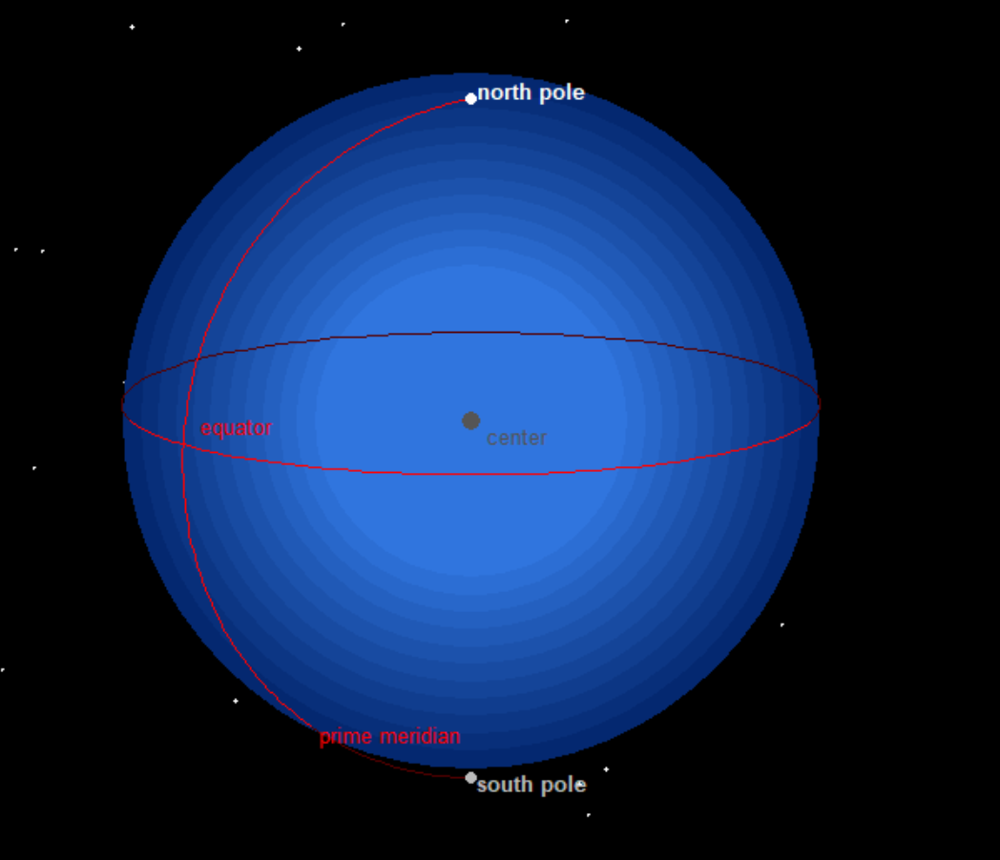
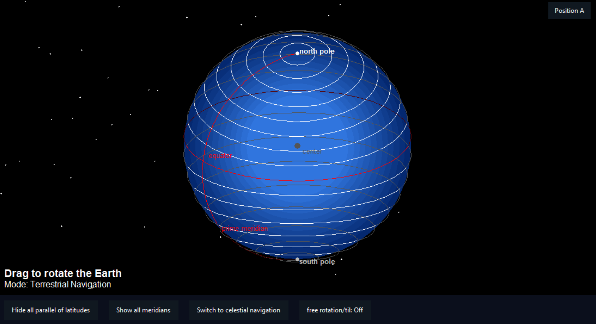
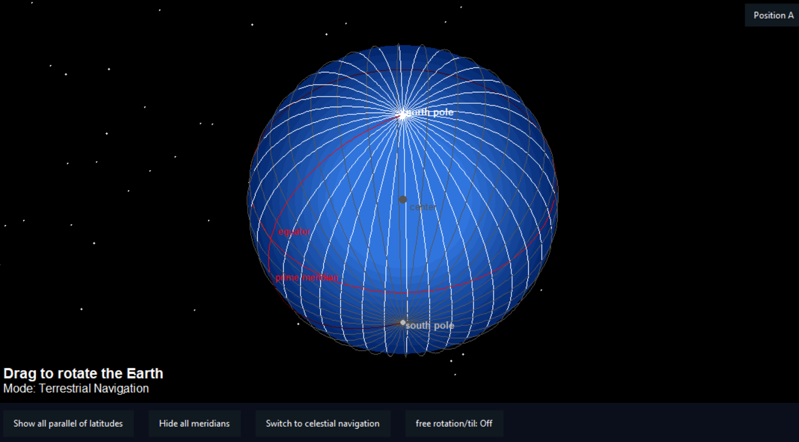
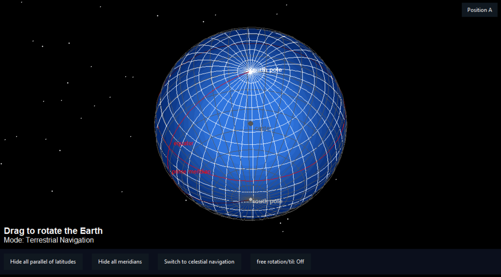
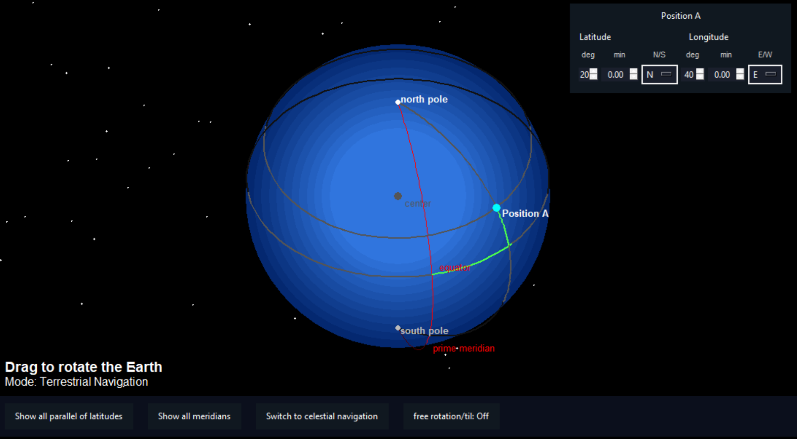

# 3D Earth Navigation Visualizer

## Overview

This project is an interactive Python-based 3D Earth visualization tool designed for teaching marine navigation concepts.

It renders an Earth-like rotating sphere inside a Tkinter GUI and helps students visually understand latitude, longitude, the equator, prime meridian, poles, meridians, parallels, and basic terrestrial/celestial navigation orientation.

The project is currently in active development and is intended as an educational aid for nautical science and maritime training.

## Purpose

Many navigation concepts are difficult for students to understand from flat diagrams alone.  
This tool aims to make spherical Earth concepts more visual, interactive, and classroom-friendly.

It can support teaching topics such as:

- Latitude and longitude
- Equator and prime meridian
- North and South Poles
- Meridians and parallels
- Terrestrial navigation orientation
- Celestial navigation orientation
- Position plotting on a globe

## Current Features

- Interactive 3D-style rotating Earth sphere
- Custom projection and rotation mathematics
- Starfield background for space-like visualization
- Display of:
  - Equator
  - Prime meridian
  - North and South Poles
  - Optional latitude parallels
  - Optional longitude meridians
- Drag-based rotation
- Two rotation modes:
  - Constrained terrestrial rotation
  - Free rotation / tilt mode
- Position A input panel for latitude and longitude
- Degree/minute input format
- N/S and E/W hemisphere selection
- Coordinate validation and clamping
- Dark-themed classroom-style interface
- Dynamic resizing with window size changes

## Technical Highlights

- Built using Python and Tkinter
- Uses canvas-based rendering
- Manual 3D point rotation
- Front/back line segment rendering for depth perception
- GUI controls for navigation teaching modes
- Developed with assistance from GitHub Copilot Agent

## Educational Use

This tool is intended for:

- Maritime Training Institutes
- Nautical science students
- Navigation instructors
- Demonstration of spherical navigation concepts
- Classroom visualization during terrestrial and celestial navigation lessons

## Current Development Status

The project is in developmental phase.

Implemented:

- Core 3D rendering
- Interactive rotation
- Grid display controls
- Position input
- Initial selected-location visualization
- Dark themed GUI

Planned improvements:

- Great circle route visualization
- Rhumb line comparison
- Multiple position plotting
- Bearing and distance demonstration
- Day/night terminator visualization
- Celestial body projection concepts
- Exportable teaching screenshots
- Web-based version for browser use
- Possible Android version in future

## Screenshot 1

## Screenshot 2

## Screenshot 3

## Screenshot 4

## Screenshot 5


## How to Run

1. Install Python 3.x

2. Clone this repository:

```bash
git clone https://github.com/ashutoshkandwal/3d-earth-navigation-visualizer.git
